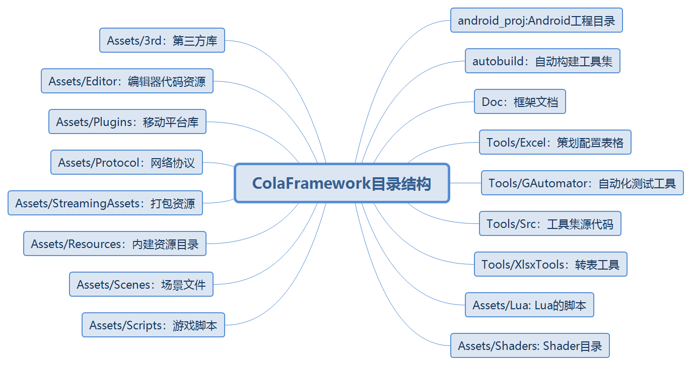
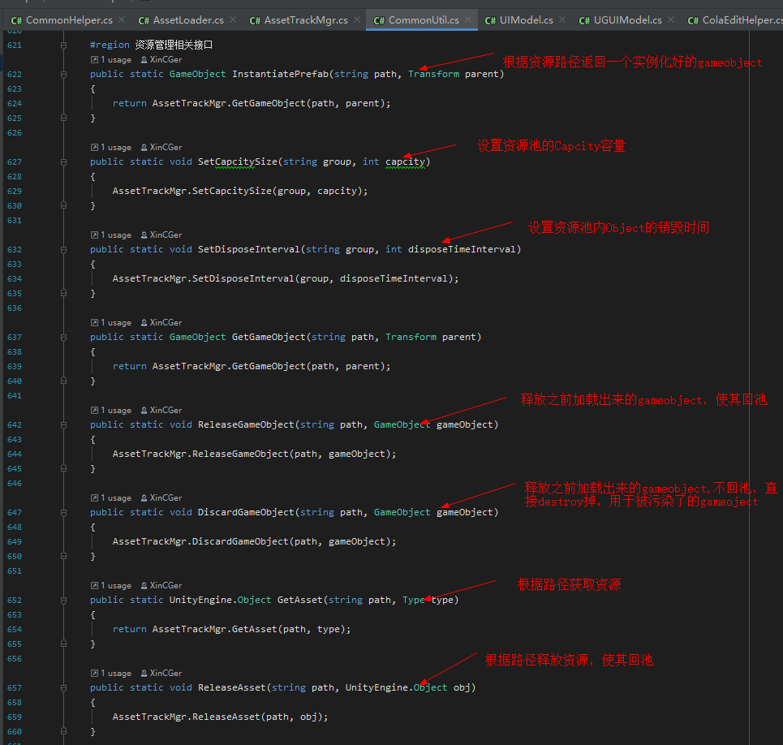

  

### ColaFrameWork Unity客户端框架(tiny精简版)  

### 框架简介  
ColaFramework 一款简洁的MVC架构的Unity客户端框架。支持Lua开发和资源热更新，自带版本管理和简易服务器。适合新手入门学习或用于中小团队开发。    
### 开发计划  
马三把近一个月内要开发的任务都放在本项目的敏捷开发面板中了。可以直接按照下面的方式查看看板中的开发计划与进度。
  
### 开发环境  
* Unity2018.2.3  
* VS2017  
* C# & Lua    
* **项目依赖Odin插件，出于版权原因，Odin并未集成进项目内，需要自行下载Odin并导入**  

### 安装集成  
可以选择以下安装方式集成本框架：
* Clone本项目到本地，与自己的代码融合或者直接在框架基础上进行开发  

### 配套视频教程  
* [ColaFramework框架教程之UI创建与导出](https://www.bilibili.com/video/BV11t4y197hx)  
* [ColaFramework框架教程之UIView控制脚本创建与UI业务逻辑开发](https://www.bilibili.com/video/BV1Ci4y1G78Q)  

### 项目手册  

#### 项目结构  
  

#### 游戏启动运行流程与机制  

目前框架的启动场景为：  
>* GameLauncher  
游戏由GameLauncher启动器脚本启动。GameLauncher为一个单例类，在游戏初始化的过程中，启动器类负责初始化GameManager、InputMgr、FpsHelper、DebuglogHelper、U3DAutomation、StreamingAssetHelper、多线程工具类等一些基础的操作。  
在一些必要的资源准备妥当以后，会执行InitGameCore()方法，该方法会调用GameManager的InitGameCore()方法，进一步地进行初始化一些次要的管理器与资源，并且启动Lua虚拟机，加载Lua的入口函数。
在GameLauncher类中，会主动调用GameManager的Update、LateUpdate、FixedUpdate、ApplicationQuit等类似于MonoBehaivor中的方法，这让您依然可以自由地在这些方法中进行处理自己的相应逻辑。  

  
  

#### 数据配置表管理   
ColaFramework框架提供了CSV版本和原生lua版本的数据配置表管理，可以根据自己的实际需要进行选择。  
详情请见[数据配置表管理Wiki页面](https://github.com/XINCGer/ColaFrameWork/wiki/%E6%95%B0%E6%8D%AE%E9%85%8D%E7%BD%AE%E8%A1%A8%E7%AE%A1%E7%90%86)  

#### 事件/消息处理中心
框架支持C#版和Lua版两套消息监听与派发机制，可以派发消息，用于V、M和C之间的解耦和消息监听等操作。具体的实现原理和用法可以看以下这篇博客：  
[【Unity游戏开发】用C#和Lua实现Unity中的事件分发机制EventDispatcher](https://www.cnblogs.com/msxh/p/9539231.html)  

#### UI框架(View层)   
* UI工作流程  
  
* UI主要方法  
  
#### 在ColaFramework框架中通过编辑器提高UI开发效率  
ColaFrameWork框架在UI开发方面提供了编辑器拓展。通过编辑器可以快速通过模版创建新的UIView类、Module类。也可以新建新的UI模版，支持C#和Lua模板。   
详见[Wiki页面](https://github.com/XINCGer/ColaFrameWork/wiki/%E5%9C%A8ColaFramework%E6%A1%86%E6%9E%B6%E4%B8%AD%E9%80%9A%E8%BF%87%E7%BC%96%E8%BE%91%E5%99%A8%E6%8F%90%E9%AB%98UI%E5%BC%80%E5%8F%91%E6%95%88%E7%8E%87)  

#### 系统框架(Module层)  
Module的基类为ModuleBase，游戏内所有的系统的业务逻辑层均继承自该类。框架采用厚Module类型的MVC结构，弱化了C层的作用，强化了M层。游戏中的业务逻辑大部分都放在M层进行处理处理。M层负责处理业务逻辑、监听网络消息、请求网络消息、派发事件通知其他模块或者UI等更新。M层不应该了解View层的存在，不可以直接调用View层，应该通过消息机制通知View做出动作。

#### 组件与实体获取  
分别支持C#端的和lua端的组件获取，详见[组件与实体获取wiki页面](https://github.com/XINCGer/ColaFrameWork/wiki/%E7%BB%84%E4%BB%B6%E4%B8%8E%E5%AE%9E%E4%BD%93%E8%8E%B7%E5%8F%96)  
#### Execl策划表格规范与转表  
本框架支持将Excel表格转为csv和lua原生格式的配置数据文件，详见[Execl策划表格规范与转表Wiki页面](https://github.com/XINCGer/ColaFrameWork/wiki/Execl%E7%AD%96%E5%88%92%E8%A1%A8%E6%A0%BC%E8%A7%84%E8%8C%83%E4%B8%8E%E8%BD%AC%E8%A1%A8)  

#### 资源管理  
AssetBundle的加载与管理是基于[xasset](https://github.com/xasset/xasset)  
在上层是AssetTrackMgr和ContainerPool，内存池和资源跟踪层，它一套弱引用+引用计数原理的资源管理层  
Lua层和C#业务逻辑层统一都通过AssetTrackMgr这个内存池和资源跟踪层去获取和归还对象  
具体的API接口设计如下：  
  

#### 资源引用查找与依赖关系分析插件  
简介  
本插件基于[blueberryzzz大佬](https://github.com/blueberryzzz) 的 [ReferenceFinder](https://github.com/blueberryzzz/ReferenceFinder)插件改造得来。感谢[blueberryzzz大佬](https://github.com/blueberryzzz)的无私分享！  
这是一个用来查找资源引用和依赖的插件，通过缓存来保存资源间的引用信息，通过树状结构直观的展示。  
由于是通过缓存进行实现的，所以在希望的到精确的引用信息时需要刷新缓存。不过由于缓存的存在，在资源改动较少的情况下，刷新速度较快，对使用影响较小。  
直接将文件夹拖到项目中即可使用。  
详情请点击 [ReferenceFinder Wiki页面](https://github.com/XINCGer/ColaFrameWork/wiki/%E8%B5%84%E6%BA%90%E5%BC%95%E7%94%A8%E6%9F%A5%E6%89%BE%E4%B8%8E%E4%BE%9D%E8%B5%96%E5%85%B3%E7%B3%BB%E5%88%86%E6%9E%90%E6%8F%92%E4%BB%B6)  
#### 编辑器拓展与工具  
可视化的EditorWindow应继承自 `EditorWindowBase` 基类，Inspector编辑拓展应继承自 `InspectorBase` 基类  
也可以直接使用继承自Odin的编辑器类进行拓展，这样会更方便一些  

#### DebugLog与日志  
ColaFramework中的Debuglog与日志相关内容请查看[Debuglog与日志Wiki页面](https://github.com/XINCGer/ColaFrameWork/wiki/DebugLog%E4%B8%8E%E6%97%A5%E5%BF%97)  

#### 日志控制台拓展  
ColaFramework框架提供了LogCat日志控制台拓展，通过它开发者可以很方便地在Unity编辑器内部查看来自Android平台下游戏的日志。它可以让你忽略AndroidStudio的存在，直接在Unity中查看筛选日志，做到无缝对接。详情查看[Wiki页面](https://github.com/XINCGer/ColaFrameWork/wiki/LogCat-%E6%97%A5%E5%BF%97%E6%8E%A7%E5%88%B6%E5%8F%B0%E6%8B%93%E5%B1%95)  
  
ColaFramework框架提供了Editor Console Pro插件，功能比原生的Console强大一些。点击错误信息会打开代码编辑器，并在编辑器中高亮显示出错的代码片段。虽然Unity自带的控制台已经可以满足一些常用需求，但结合一些高级功能会更加有助于项目调试，例如直接在控制台显示代码所在位置并且高亮。一个很重要的区别是：在Editor Console Pro中，出错的源代码会被直接显示在窗口中，一目了然，方便开发者直接定位出错的地方。更多介绍可以看这个文档: [Unity插件推荐Editor Console Pro](https://blog.csdn.net/wwlcsdn000/article/details/80542607)  

#### 网络通信与协议  
框架采用TCP网络连接，协议采用的是sproto协议，C#层封装了相关API，Lua层负责调用接口和注册回调，C#中主要是SocketManger和MessageCenter这两个类。SocketManger主要封装了网络的连接、断开、消息的发送与接收。
MessageCenter相当于一个网络消息缓存中心，用于分帧处理网络消息并抛到Lua层执行对应的handle函数。

#### 寻路系统  
ColaFramework框架目前集成了AStar、Recast两种寻路系统。  

#### 插值动画/缓动动画  
ColaFramework框架集成了DoTween、iTween两款比较常见的插值动画/缓动动画插件，并且自己拓展封装了适合UGUI的UGUITween组件，可以像NGUI中的Tween一样使用，非常方便，用来解决一些简单的Tween动画效果再合适不过了。  
其中拓展UGUITween组件包含以下几个常用的Tween组件：  
>* UGUITweenScale  
>* UGUITweenPosition  
>* UGUITweenAlpha  
>* UGUITweenRotation  

#### 命名空间  
ColaFramework中框架级的Core源码都从属于ColaFramework命名空间，一些过时的、被废弃的插件会被移动到Abandoned目录下，命名空间也会变为ColaAbandoned，并且被打上 ``[Obsolete]`` 标记，表明该模块已被废弃。  

#### 联系方式  
* QQ群：421527940  
  

#### 友情链接  
* [IFramework](https://github.com/OnClick9927/IFramework)  
* [xasset 一个简易轻量的Unity资源管理框架](https://github.com/xasset/xasset)  
* [anything_about_game(夜莺人行自走库)](https://github.com/killop/anything_about_game)  

